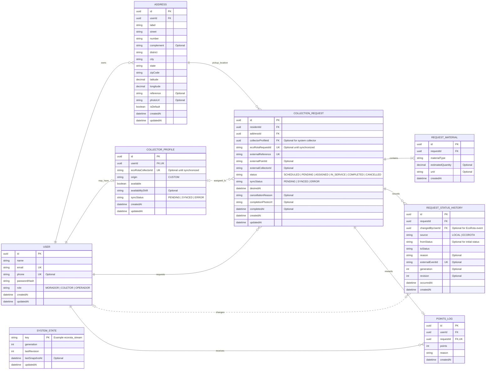

# WAD - Modelagem de dados do EcoRota

## 1. Objetivo

Este documento define a modelagem de dados do MVP EcoRota, com base no case técnico, nos requisitos funcionais, no plano de implementação e nas decisões arquiteturais do projeto.

O modelo cobre os dados que pertencem à aplicação:

- cadastro e autenticação de usuários;
- endereços dos moradores;
- vínculo entre usuários coletores e coletores `custom` da EcoRota;
- solicitações de coleta e materiais;
- histórico de alterações de status;
- pontos concedidos após uma coleta concluída;
- controle de sincronização com a API EcoRota.

## 2. Limite da modelagem

A aplicação utiliza PostgreSQL hospedado no Supabase e Prisma ORM. O Supabase é responsável por hospedar o banco; o Prisma representa os modelos, relacionamentos e migrations utilizados pelo backend Fastify.

```text
Frontend React -> API Fastify -> Prisma -> PostgreSQL Supabase
                                  |
                                  +-> API e WebSocket EcoRota
```

### 2.1 Dados persistidos pela aplicação

São persistidos os dados que a EcoRota não fornece ou que precisam de histórico próprio:

- usuários e papéis;
- endereços;
- perfil do coletor da aplicação;
- associação entre pedido local e pedido externo;
- materiais informados pelo morador;
- histórico de status;
- gamificação;
- checkpoint de sincronização.

### 2.2 Dados não persistidos como entidades próprias neste MVP

Os seguintes dados pertencem à plataforma EcoRota e serão mantidos no `OperationState` em memória:

- pontos de coleta;
- coletores automáticos do tipo `system`;
- posição atual dos coletores;
- rotas dinâmicas;
- telemetria operacional.

Quando necessário, seus identificadores externos serão armazenados em `CollectionRequest` e `CollectorProfile`. Essa decisão evita duplicar no Supabase dados cujo sistema de origem é a EcoRota.

## 3. Entidades escolhidas

| Entidade | Responsabilidade | Requisitos atendidos |
|---|---|---|
| `User` | Identidade, credenciais e papel do usuário | RF01, RF02 |
| `Address` | Endereço de coleta pertencente ao morador | RF03, RF04 |
| `CollectorProfile` | Dados específicos do coletor e vínculo com a EcoRota | RF02, RF08, RF09, RF10 |
| `CollectionRequest` | Solicitação, agendamento, integração externa e status atual | RF04, RF05, RF06, RF08-RF15 |
| `RequestMaterial` | Um ou mais materiais associados à solicitação | RF05, RF09 |
| `RequestStatusHistory` | Linha do tempo confiável das mudanças da coleta | RF06, RF11, RF12, RF15 |
| `PointsLog` | Crédito idempotente de pontos após conclusão | RF13, RF16, RF17 |
| `SystemState` | `generation` e `revision` aplicadas do stream EcoRota | RF14, RF15 e resiliência |

## 4. Diagrama entidade-relacionamento



## 5. Relacionamentos e cardinalidades

### 5.1 `User` e `Address`

Um usuário morador pode cadastrar nenhum ou vários endereços. Cada endereço pertence exatamente a um usuário.

```text
User 1 -> 0..N Address
```

### 5.2 `User` e `CollectorProfile`

Um usuário pode não possuir perfil de coletor ou possuir exatamente um. Um perfil de coletor pertence a exatamente um usuário.

```text
User 1 -> 0..1 CollectorProfile
```

O campo `role` de `User` determina se o usuário pode acessar as funcionalidades de morador, coletor ou operador. `CollectorProfile` guarda apenas informações específicas do coletor.

### 5.3 `User`, `Address` e `CollectionRequest`

Um morador pode realizar várias solicitações. Cada solicitação pertence a um morador e utiliza um endereço cadastrado por ele.

```text
User 1 -> 0..N CollectionRequest
Address 1 -> 0..N CollectionRequest
```

O serviço deve validar que o `Address.userId` é igual ao `CollectionRequest.residentId`.

### 5.4 `CollectorProfile` e `CollectionRequest`

Uma solicitação pode ainda não possuir coletor, pode ser atendida por um coletor `system` da EcoRota ou pode ser atribuída a um coletor `custom` da aplicação.

- `collectorProfileId`: utilizado quando existe um coletor `custom` com usuário local;
- `externalCollectorId`: utilizado para registrar o coletor informado pela EcoRota, inclusive coletores `system`.

Essa relação é opcional porque a solicitação pode estar aguardando atribuição.

### 5.5 `CollectionRequest` e `RequestMaterial`

Toda solicitação precisa possuir pelo menos um material. A entidade separada permite registrar vários tipos de materiais sem duplicar a solicitação.

```text
CollectionRequest 1 -> 1..N RequestMaterial
```

### 5.6 `CollectionRequest` e `RequestStatusHistory`

`CollectionRequest.status` representa o estado atual para consultas rápidas. `RequestStatusHistory` registra cada alteração e preserva o histórico exigido pelo case.

Cada registro informa:

- status anterior e novo status;
- data efetiva da mudança;
- origem local ou EcoRota;
- usuário responsável, quando existir;
- identificador e revisão do evento externo, quando existir.

### 5.7 `CollectionRequest` e `PointsLog`

Uma solicitação pode gerar zero ou um lançamento de pontos. O campo `PointsLog.requestId` é único para impedir que o mesmo evento `request.completed` conceda pontos duas vezes.

```text
CollectionRequest 1 -> 0..1 PointsLog
```

### 5.8 `SystemState`

`SystemState` é uma entidade técnica independente, utilizada para persistir o último `generation` e `revision` processados do stream EcoRota. Isso permite detectar reset do cenário, rejeitar eventos antigos e retomar a sincronização após reinício do backend.

## 6. Regras de integridade

1. `User.email` deve ser único.
2. `User.role` deve aceitar apenas `MORADOR`, `COLETOR` ou `OPERADOR`.
3. `CollectorProfile.userId` deve ser único.
4. `CollectionRequest.externalReference` deve ser único e criado antes da chamada à EcoRota.
5. `CollectionRequest.ecoRotaRequestId` deve ser único quando preenchido.
6. Toda solicitação deve possuir pelo menos um `RequestMaterial`.
7. O endereço utilizado precisa pertencer ao morador da solicitação.
8. Apenas solicitações nos estados permitidos podem ser canceladas.
9. Apenas uma solicitação `IN_SERVICE` pode ser concluída pelo coletor responsável.
10. `COMPLETED` e `CANCELLED` são estados finais.
11. Um `PointsLog` só pode ser criado para uma solicitação `COMPLETED`.
12. A unicidade de `PointsLog.requestId` deve garantir a idempotência da recompensa.
13. Eventos com `generation` anterior ou `revision` já processada devem ser ignorados.
14. Credenciais, senhas e tokens nunca devem ser armazenados sem proteção ou retornados pela API.

## 7. Enumerações sugeridas

As enumerações abaixo não são entidades independentes porque representam conjuntos fechados de valores.

```text
UserRole
- MORADOR
- COLETOR
- OPERADOR

RequestStatus
- SCHEDULED
- PENDING
- ASSIGNED
- IN_SERVICE
- COMPLETED
- CANCELLED

SyncStatus
- PENDING
- SYNCED
- ERROR

StatusSource
- LOCAL
- ECOROTA

MaterialType
- PAPER
- PLASTIC
- GLASS
- METAL
- ELECTRONICS
- ORGANIC
- OTHER
```

A lista de materiais deve ser confirmada com o contrato oficial da API EcoRota antes da implementação.

## 8. Entidades futuras, fora do MVP essencial

As seguintes entidades podem ser adicionadas depois, sem bloquear o fluxo principal:

| Entidade futura | Uso |
|---|---|
| `Badge` e `UserBadge` | Selos e conquistas do morador |
| `Goal` e `UserGoal` | Metas mensais de reciclagem |
| `Notification` | Registro de notificações enviadas |
| `CollectionEvidence` | Múltiplas fotos e comprovantes por atendimento |
| `SyncAttempt` | Auditoria detalhada de retries da integração |

## 9. Decisão sobre autenticação

O diagrama assume autenticação própria no Fastify, com `passwordHash` em `User` e JWT em cookie `httpOnly`, conforme a arquitetura atual.

Caso o time decida utilizar Supabase Auth, a modelagem deve mudar:

- remover `passwordHash` de `User`;
- adicionar `authUserId` único para referenciar `auth.users`;
- manter os papéis e dados de domínio na tabela `User` da aplicação.

Essa decisão deve ser tomada antes de criar a migration inicial.

## 10. Correspondência com o Prisma atual

O arquivo `apps/api/prisma/schema.prisma` contém atualmente apenas o model `User`. Portanto, o diagrama deste documento representa o **modelo-alvo proposto**, ainda não a estrutura já implementada no banco.

A ordem recomendada para implementação é:

1. definir os enums;
2. completar `User`;
3. implementar `Address` e `CollectorProfile`;
4. implementar `CollectionRequest` e `RequestMaterial`;
5. implementar `RequestStatusHistory`;
6. implementar `PointsLog`;
7. implementar `SystemState`;
8. revisar índices e restrições de unicidade;
9. gerar e revisar a migration;
10. aplicar a migration no PostgreSQL do Supabase.

## 11. Premissas adotadas

1. O banco Supabase é utilizado como PostgreSQL hospedado; o frontend não acessa suas tabelas diretamente.
2. Toda regra de negócio passa pelo backend Fastify.
3. A EcoRota é a fonte oficial dos dados operacionais em tempo real.
4. O banco local é a fonte oficial de usuários, endereços, gamificação e histórico próprio.
5. Uma solicitação pode conter mais de um material.
6. Coletores `system` não precisam possuir usuário local.
7. O histórico de status é persistido para auditoria e acompanhamento do morador.
8. Pontos são concedidos uma única vez e somente após confirmação de conclusão.

## 12. Mapeamento dos endpoints da API

Esta seção define o contrato REST alvo do MVP. As rotas existentes no código ainda se limitam a `GET /health`; portanto, os endpoints abaixo deverão ser implementados no Fastify.

### 12.1 Padrão de nomenclatura

- prefixo de versão: `/api/v1`;
- caminhos em português, minúsculos, sem acentos e com palavras separadas por hífen;
- substantivos no plural para coleções, como `/enderecos` e `/solicitacoes-coleta`;
- ações que representam mudanças de estado usam substantivos, como `/cancelamento` e `/conclusao`;
- corpo e resposta JSON em português, usando `camelCase`;
- identificadores no formato UUID;
- datas no padrão ISO 8601 e armazenadas em UTC;
- autenticação enviada por cookie `httpOnly`;
- paginação com os parâmetros `pagina` e `limite`;
- filtros adicionais enviados pela query string.

O contrato público utiliza valores em português. O serviço de integração é responsável por convertê-los para os valores usados internamente e pela API EcoRota.

| Conceito | Valor interno/EcoRota | Valor na API pública |
|---|---|---|
| Agendada | `SCHEDULED` | `AGENDADA` |
| Pendente | `PENDING` | `PENDENTE` |
| Atribuída | `ASSIGNED` | `ATRIBUIDA` |
| Em atendimento | `IN_SERVICE` | `EM_ATENDIMENTO` |
| Concluída | `COMPLETED` | `CONCLUIDA` |
| Cancelada | `CANCELLED` | `CANCELADA` |
| Sincronização pendente | `PENDING` | `PENDENTE` |
| Sincronizada | `SYNCED` | `SINCRONIZADO` |
| Erro de sincronização | `ERROR` | `ERRO` |

O mesmo padrão se aplica aos materiais: `PAPER` vira `PAPEL`, `PLASTIC` vira `PLASTICO`, `GLASS` vira `VIDRO`, `METAL` permanece `METAL`, `ELECTRONICS` vira `ELETRONICOS`, `ORGANIC` vira `ORGANICO` e `OTHER` vira `OUTRO`.

Exemplo de erro padronizado:

```json
{
  "codigo": "SOLICITACAO_NAO_ENCONTRADA",
  "mensagem": "A solicitação de coleta não foi encontrada.",
  "detalhes": null
}
```

### 12.2 Saúde da aplicação

| Método | Endpoint | Acesso | Finalidade |
|---|---|---|---|
| `GET` | `/api/v1/saude` | Público | Verificar se a API está em execução. |

> Ao implementar o novo padrão, a rota provisória `GET /health` deverá ser substituída por `GET /api/v1/saude`.

### 12.3 Autenticação e sessão

| Método | Endpoint | Acesso | Finalidade | Requisito |
|---|---|---|---|---|
| `POST` | `/api/v1/autenticacao/cadastro` | Público | Cadastrar morador ou coletor. | RF01, RF02 |
| `POST` | `/api/v1/autenticacao/entrar` | Público | Validar credenciais e criar a sessão. | RF01 |
| `POST` | `/api/v1/autenticacao/sair` | Autenticado | Encerrar a sessão e remover o cookie. | RF01 |
| `GET` | `/api/v1/autenticacao/sessao` | Autenticado | Retornar o usuário e o papel da sessão atual. | RF02 |

O cadastro recebe `nome`, `email`, `telefone`, `senha` e `papel`. O backend nunca deve retornar a senha nem o hash da senha.

### 12.4 Perfil e endereços

| Método | Endpoint | Acesso | Finalidade | Requisito |
|---|---|---|---|---|
| `GET` | `/api/v1/perfil` | Autenticado | Consultar os dados do usuário atual. | RF01, RF02 |
| `PATCH` | `/api/v1/perfil` | Autenticado | Atualizar nome e telefone do usuário atual. | RF01 |
| `GET` | `/api/v1/enderecos` | Morador | Listar os próprios endereços. | RF03 |
| `POST` | `/api/v1/enderecos` | Morador | Cadastrar um endereço. | RF03 |
| `GET` | `/api/v1/enderecos/:enderecoId` | Morador | Consultar um endereço próprio. | RF03 |
| `PATCH` | `/api/v1/enderecos/:enderecoId` | Morador | Atualizar endereço, foto ou definição de endereço padrão. | RF03 |
| `DELETE` | `/api/v1/enderecos/:enderecoId` | Morador | Excluir um endereço que não esteja vinculado a uma coleta ativa. | RF03 |

O usuário é obtido da sessão. Por isso, não se envia `usuarioId` na URL nem no corpo dessas operações.

### 12.5 Solicitações de coleta

| Método | Endpoint | Acesso | Finalidade | Requisito |
|---|---|---|---|---|
| `POST` | `/api/v1/solicitacoes-coleta` | Morador | Criar e integrar uma solicitação com a EcoRota. | RF04, RF05, RF14 |
| `GET` | `/api/v1/solicitacoes-coleta` | Morador | Listar as próprias solicitações, com filtros por status e período. | RF06, RF12 |
| `GET` | `/api/v1/solicitacoes-coleta/:solicitacaoId` | Morador ou coletor responsável | Consultar os detalhes da solicitação. | RF06, RF09 |
| `GET` | `/api/v1/solicitacoes-coleta/:solicitacaoId/historico-status` | Morador ou coletor responsável | Consultar a linha do tempo da coleta. | RF06, RF12, RF15 |
| `POST` | `/api/v1/solicitacoes-coleta/:solicitacaoId/cancelamento` | Morador ou coletor responsável | Cancelar a solicitação e registrar o motivo. | RF11 |
| `POST` | `/api/v1/solicitacoes-coleta/:solicitacaoId/inicio` | Coletor responsável | Iniciar o atendimento da coleta. | RF10 |
| `POST` | `/api/v1/solicitacoes-coleta/:solicitacaoId/conclusao` | Coletor responsável | Concluir a coleta e registrar a foto comprobatória. | RF10, RF13, RF16 |

Filtros previstos para a listagem:

```text
GET /api/v1/solicitacoes-coleta?status=PENDENTE&dataInicio=2026-09-01&dataFim=2026-09-30&pagina=1&limite=20
```

Exemplo de criação:

```json
{
  "enderecoId": "4ef751bd-d62f-4a1d-a6ea-f018f2cf9be5",
  "dataDesejada": "2026-09-25T14:00:00.000Z",
  "pontoColetaExternoId": "ponto-12",
  "materiais": [
    {
      "tipo": "PLASTICO",
      "quantidadeEstimada": 5,
      "unidade": "kg"
    }
  ]
}
```

Resposta esperada após a criação:

```json
{
  "id": "1d154150-90e0-44bd-99bc-216697824c2a",
  "referenciaExterna": "pedido-1d154150-90e0-44bd-99bc-216697824c2a",
  "status": "PENDENTE",
  "statusSincronizacao": "SINCRONIZADO",
  "dataDesejada": "2026-09-25T14:00:00.000Z"
}
```

### 12.6 Área do coletor

| Método | Endpoint | Acesso | Finalidade | Requisito |
|---|---|---|---|---|
| `GET` | `/api/v1/coletor/solicitacoes` | Coletor | Listar as coletas atribuídas ao coletor atual. | RF08 |
| `GET` | `/api/v1/coletor/disponibilidade` | Coletor | Consultar disponibilidade e turno atuais. | RF08 |
| `PATCH` | `/api/v1/coletor/disponibilidade` | Coletor | Alterar disponibilidade e turno e sincronizar com a EcoRota. | RF08, RF14 |

Os detalhes e as mudanças de estado usam os endpoints compartilhados de `/solicitacoes-coleta/:solicitacaoId`. O backend deve validar que a solicitação está atribuída ao coletor autenticado.

### 12.7 Exploração de pontos e coletores

| Método | Endpoint | Acesso | Finalidade | Origem dos dados | Requisito |
|---|---|---|---|---|---|
| `GET` | `/api/v1/pontos-coleta` | Autenticado | Listar pontos de coleta, com localização e situação. | `OperationState` | RF07 |
| `GET` | `/api/v1/pontos-coleta/:pontoId` | Autenticado | Consultar os detalhes de um ponto. | `OperationState` | RF07 |
| `GET` | `/api/v1/coletores/disponiveis` | Autenticado | Listar coletores disponíveis próximos de uma coordenada. | `OperationState` | RF07 |

Filtros geográficos sugeridos:

```text
GET /api/v1/pontos-coleta?latitude=-23.5505&longitude=-46.6333&raioKm=10
GET /api/v1/coletores/disponiveis?latitude=-23.5505&longitude=-46.6333&raioKm=10
```

### 12.8 Pontuação e classificação

| Método | Endpoint | Acesso | Finalidade | Requisito |
|---|---|---|---|---|
| `GET` | `/api/v1/pontuacao/resumo` | Morador | Consultar saldo, total acumulado e impacto registrado. | RF13, RF17 |
| `GET` | `/api/v1/pontuacao/lancamentos` | Morador | Listar os créditos de pontos do usuário. | RF16, RF17 |
| `GET` | `/api/v1/pontuacao/classificacao` | Autenticado | Consultar a classificação dos participantes. | RF17 |

Não deve existir endpoint público para conceder pontos. O lançamento é criado internamente quando o backend confirma o evento de conclusão da EcoRota.

### 12.9 Operação EcoRota

| Método | Endpoint | Acesso | Finalidade | Requisito |
|---|---|---|---|---|
| `GET` | `/api/v1/operacao/indicadores` | Operador | Retornar KPIs de coletas e coletores. | RF18 |
| `GET` | `/api/v1/operacao/solicitacoes` | Operador | Listar solicitações recentes e seus estados. | RF18 |
| `GET` | `/api/v1/operacao/coletores` | Operador | Exibir coletores, disponibilidade e última posição. | RF18 |
| `GET` | `/api/v1/operacao/pontos-coleta` | Operador | Exibir os pontos usados no mapa operacional. | RF18 |
| `GET` | `/api/v1/operacao/usuarios` | Operador | Listar informações básicas de moradores e coletores. | RF18 |
| `GET` | `/api/v1/operacao/integracao` | Operador | Informar conexão, `generation`, última `revision` e horário do snapshot. | RF14, RF15 |

### 12.10 Comunicação em tempo real

O Socket.IO utiliza o namespace `/tempo-real`. Depois de autenticado, o cliente entra apenas nas salas autorizadas para seu papel e usuário.

| Evento | Destinatário | Conteúdo |
|---|---|---|
| `operacao:estado-inicial` | Operador | Snapshot atual de pontos, coletores e solicitações. |
| `coletor:posicao-atualizada` | Operador e morador relacionado | Posição, horário de observação e indicação de telemetria antiga. |
| `solicitacao:status-atualizado` | Morador, coletor responsável e operador | Identificador, status anterior, novo status e data da mudança. |
| `solicitacao:atribuida` | Morador, coletor responsável e operador | Dados básicos da atribuição. |
| `solicitacao:concluida` | Morador, coletor responsável e operador | Confirmação da conclusão e pontuação concedida. |

O WebSocket da EcoRota continua sendo consumido exclusivamente pelo backend. Navegadores nunca recebem a credencial externa nem se conectam diretamente à plataforma.

### 12.11 Códigos HTTP esperados

| Código | Uso |
|---|---|
| `200` | Consulta ou atualização concluída. |
| `201` | Recurso criado. |
| `204` | Exclusão ou encerramento sem corpo de resposta. |
| `400` | Corpo, parâmetro ou transição de status inválida. |
| `401` | Sessão ausente ou inválida. |
| `403` | Usuário sem permissão para a operação. |
| `404` | Recurso não encontrado ou não pertencente ao usuário. |
| `409` | Conflito de regra de negócio ou duplicidade. |
| `422` | Dados válidos sintaticamente, mas rejeitados pela regra de negócio. |
| `429` | Limite de requisições excedido. |
| `502` | Falha de comunicação com a API EcoRota. |
| `503` | Serviço ou sincronização temporariamente indisponível. |

### 12.12 Ordem recomendada de implementação

1. `saude` e tratamento padronizado de erros;
2. `autenticacao` e controle de acesso por papel;
3. `perfil` e `enderecos`;
4. criação, consulta e cancelamento de `solicitacoes-coleta`;
5. rotas do `coletor`, início e conclusão;
6. leitura de `pontos-coleta` e `coletores/disponiveis` pelo `OperationState`;
7. `pontuacao` acionada pela conclusão confirmada;
8. endpoints de `operacao`;
9. eventos do namespace `/tempo-real`.
